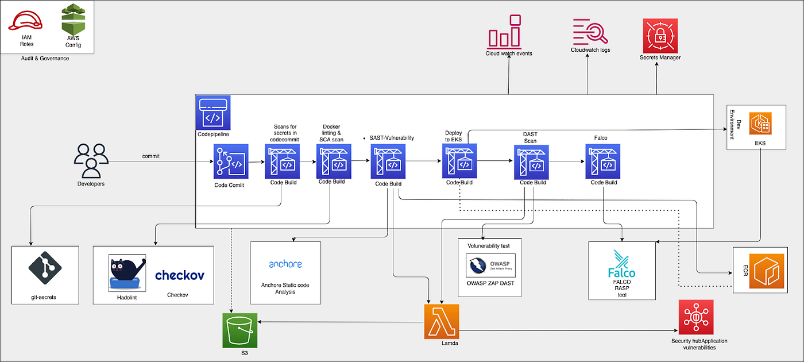
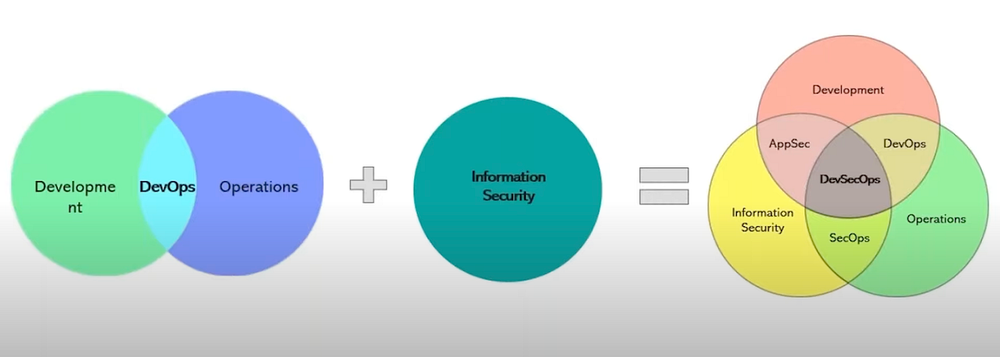
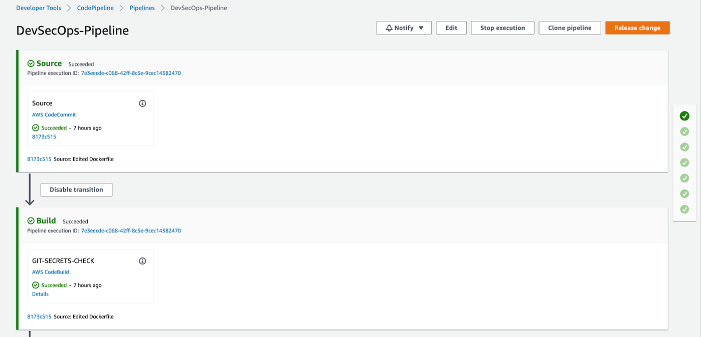
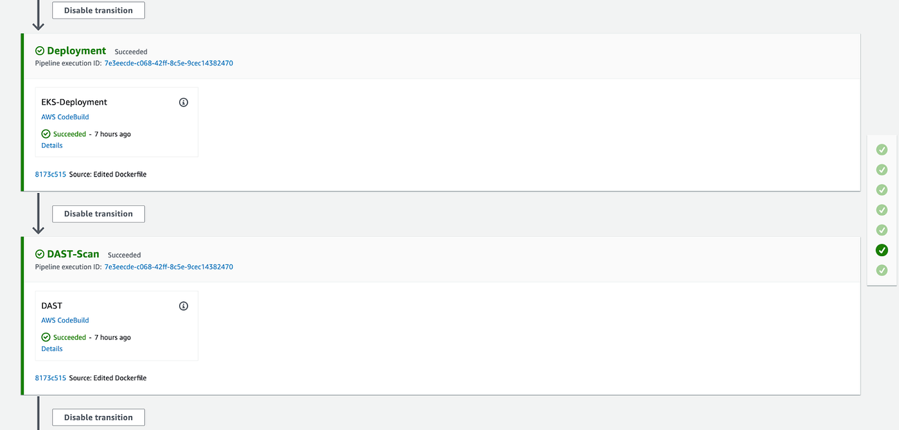
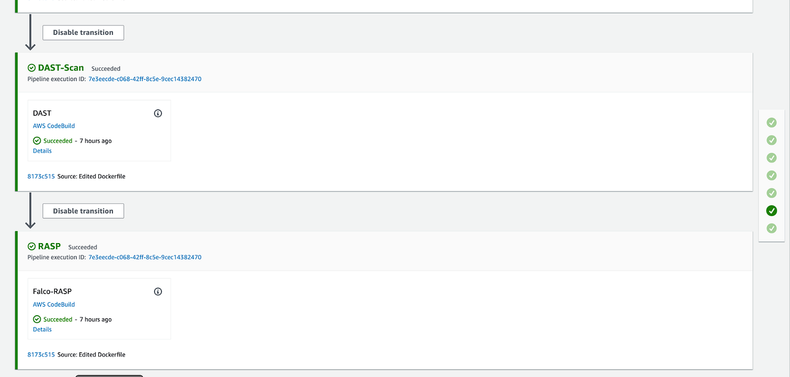
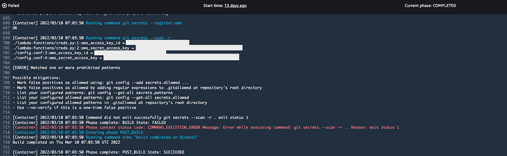

# AWS native DevSecOps pipeline 

## For Code Signing Artifacts sub-project : Kindly check here [Github Link](https://github.com/shobitgg/Continuous_Security-Azure_Devops-AWS_Devops-Code_Signing_Docker_images-Azure_sign-SigStore_Cosign)
****
## Below architecture has all the tools used for this project . 
I am are going to build the below CI/CD Pipeline in AWS by using AWS native developer tools such as 



Before this as a breif description about what is DevSecOps?
DevOps is a combination of cultural philosophies, practices, and tools that combine software development with information technology operations. These combined practices enable companies to deliver new application features and improved services to customers at a higher velocity.



## Security Vulnerability Scanning Stages

To identify security vulnerabilities at various stages, organisations can integrate various tools and services (cloud and third-party) into their DevSecOps pipelines. 

1.Secret Analysis
Secrets Scanning refers to the process of identifying secrets embedded in code repositories . Some examples of secrets scanning tools are — Git-secrets, Trufflehog, detect-secrets.


2.SCA/SAST (Static Application Security Testing)
Static code analysis, also known as static code review, is the process of detecting bad coding style, potential vulnerabilities, and security flaws in a software’s source code without actually running it . Some examples of SCA/SAST are Trivy or Sync or Anchor or CoreOS Clair.

3.DAST (Dynamic Application Security Testing)
DAST scanners are a good first step in turning DevOps into DevSecOps. They make it less frustrating for developers to deal with vulnerability scanning and easier for them to understand the security risk. DAST ranks vulnerabilities, given the context, into three categories: High, Medium, and Low and DAST scanners can be seamlessly integrated into your CI/CD pipeline.
Some of the good DAST tools available in the market are OWASP ZAP, Crash test Security, Arachni.

4. RASP
RASP is a technology that runs on a server and kicks in when an application runs. It’s designed to detect attacks on an application in real time. When an application begins to run, RASP can protect it from malicious input or behaviour by analysing both the app’s behaviour and the context of that behaviou

## DevSecOps tool stack

Below tool stack has been used for the EKS deployment process in AWS.

Hadolint — Dockerfile linter, validate inline bash, written in Haskell.

Git-Secret — Checks whether the Developer is checking any sensitive information to code repositories.

Anchore and Checkov — SCA and SAST

ECR Scanning — In-built feature (which uses clair for scanning internally)

OWASP ZAP — Dynamic Application Security test — DAST

Falco — Runtime Application Self Protection — RASP


## Prerequisites:
1. An AWS account with proper IAM roles and policies attached.
2. An EKS cluster with a minimum number of nodes.
3. A CodeCommit/github repo with your application code.
4. AWS Config and Security Hub enabled.
5. Basic Knowledge on AWS developer services such as CodePipeline, CodeBuild, CodeCommit, EKS, Lambda and ECR.

Assuming we have all the code and buildspec.yml files present in the CodeCommit/github repository and an eks cluster configured with node groups.


## AWS CODEPIPELINE:
Below is the final Pipeline screenshot with all the stages included.






To trigger the pipeline, commit changes to your Github repository. That generates a CloudWatch event and triggers the pipeline. CodeBuild scans the code and if there are any vulnerabilities, it invokes the Lambda function to parse and post the results to Security Hub.

## Git-Secrets-Check stage:
In the pipeline the second stage is Git Secrets Check, where the Github repository is scanned by the git-secrets tool. It will scan the whole repository and find any sensitive information such as credentials in the repository then Codebuild fails. If there is no sensitive information then the build succeeds.



```
#  Copyright Amazon.com, Inc. or its affiliates. All Rights Reserved.
#  SPDX-License-Identifier: MIT-0
version: 0.2
env:
  git-credential-helper: yes
phases:
  install:
    commands:
      - echo "in the install phase"
      - yum -y update
      #- yum -y install jq 
      - curl -s -qL -o /usr/bin/jq https://stedolan.github.io/jq/download/linux64/jq
      - chmod +x /usr/bin/jq
      - curl https://bootstrap.pypa.io/get-pip.py | python3
      - pip3 install --upgrade awscli
    finally:
      - echo This always runs even if the login command fails 
  pre_build:
    commands:
      - echo "Setting CodeCommit Credentials"
  build:
    commands:
      - echo "Build started on $(date)"
      - git clone https://github.com/awslabs/git-secrets
      - cd git-secrets
      - make install
      - cd $CODEBUILD_SRC_DIR
      - ls -lrta
      - cd git-secrets
      - git secrets --install
      - git secrets --register-aws
      ## Adding additional patterns, for example password
      #- git secrets --add password\s*=\s*.+
      - git secrets --scan -r .
  post_build:
    commands:
      - echo "Build completed on $(date)"
artifacts:
  type: zip
  files: '**/*'
  
 ```
 
 
 ## Hadolint -Checkov stage:
 Checkov is a static code analysis tool for scanning infrastructure as code (IaC) files for misconfigurations that may lead to security or compliance problems. Checkov scans these IaC file types: Terraform (for AWS, GCP, Azure and OCI),CloudFormation (including AWS SAM),Azure Resource Manager (ARM),Serverless framework,Helm charts,Kubernetes,Docker.


In this stage the Hadolint tool will scan the Dockerfile and find if there is any syntax issue in the Dockerfile. HADOLINT is a smarter Dockerfile linter that helps you build best practice Docker images. The linter is parsing the Dockerfile into an AST and performs rules on top of the AST. It additionally is using the famous Shellcheck to lint the Bash code inside RUN instructions.


```
version: 0.2
run-as: root

phases:

  install:
    commands:
      - echo Installing app dependencies and Kubectl tool for K8s...
      - curl -o kubectl https://amazon-eks.s3.us-west-2.amazonaws.com/1.18.9/2020-11-02/bin/linux/amd64/kubectl   
      - chmod +x ./kubectl
      - mkdir -p $HOME/bin && cp ./kubectl $HOME/bin/kubectl && export PATH=$PATH:$HOME/bin
      - echo 'export PATH=$PATH:$HOME/bin' >> ~/.bashrc
      - source ~/.bashrc
      - echo 'Check kubectl version'
      - kubectl version --short --client
      - echo Downloading the Hadolint tool...
      - wget -O hadolint https://github.com/hadolint/hadolint/releases/download/v1.16.3/hadolint-Linux-x86_64
      - cp hadolint /bin
      - chmod +x /bin/hadolint
      - /bin/hadolint --version
      - echo Installing Checkov:static code analysis tool for scanning infrastructure as code files for misconfigurations...!! 
      - curl https://bootstrap.pypa.io/get-pip.py | python3
      - pip3 install checkov
      - checkov --version 

  pre_build:
    commands:
      - echo Running Hadolint and Checkov tools on the Dockerfile
  build:
    commands:
      - echo Build started on `date`
      - echo Validating the Dockerfile using Hadolint tool...
      - /bin/hadolint docker_files/Dockerfile
      - echo Using Checkov tool for scanning the Dockerfile...
      - checkov -f docker_files/Dockerfile

  post_build:
    commands:
      - echo Build completed on `date`
 
 ```
 
 
 ## SAST-Anchore stage:
 
 In this stage the Dockerfile will be built and scanned by Anchore tool to find if any vulnerabilities are present in the Docker Image. Anchore tool will save the vulnerability results in json format file and using Lambda function the contents of the file will be uploaded to SecurityHub where we can find the High, Medium and Low vulnerabilities with all the details, then the docker image will be uploaded to ECR repository. These reports will be helpful to the Development team to remediate the vulnerabilities.
 
 
 ```
 #  Copyright Amazon.com, Inc. or its affiliates. All Rights Reserved.
#  SPDX-License-Identifier: MIT-0
version: 0.2
phases:
  install:
    commands:
      - echo "in the install phase"
      - curl -sS -o kubectl https://amazon-eks.s3.us-west-2.amazonaws.com/1.18.9/2020-11-02/bin/linux/amd64/kubectl
      - chmod +x ./kubectl
      - yum -y update
      - curl -s -qL -o /usr/bin/jq https://stedolan.github.io/jq/download/linux64/jq
      - chmod +x /usr/bin/jq
      - curl https://bootstrap.pypa.io/get-pip.py | python3
      - pip3 install --upgrade awscli
      - yum install docker -y
    finally:
      - echo This always runs even if the login command fails    
  pre_build:
    commands:
      - echo "inside pre_build stage"
      - nohup /usr/local/bin/dockerd --host=unix:///var/run/docker.sock --host=tcp://0.0.0.0:2375 --storage-driver=overlay&
      - timeout 15 sh -c "until docker info; do echo .; sleep 1; done"
      - echo "stage pre_build completed"
      - REPOSITORY_URI=$AWS_ACCOUNT_ID.dkr.ecr.$AWS_DEFAULT_REGION.amazonaws.com/$IMAGE_REPO_NAME
  build:
    commands:
      - echo "inside build stage"
      - cd $CODEBUILD_SRC_DIR
      - docker build -t $IMAGE_REPO_NAME:$CODEBUILD_RESOLVED_SOURCE_VERSION docker_files/.
      - curl -s https://ci-tools.anchore.io/inline_scan-v0.6.0 | bash -s -- -r $IMAGE_REPO_NAME:$CODEBUILD_RESOLVED_SOURCE_VERSION 
      - TAG="$CODEBUILD_RESOLVED_SOURCE_VERSION"
      - docker tag $IMAGE_REPO_NAME:$CODEBUILD_RESOLVED_SOURCE_VERSION $REPOSITORY_URI:latest
      - $(aws ecr get-login --no-include-email --region $AWS_DEFAULT_REGION)
  post_build:
    commands:
      - |
        jq "{ \"messageType\": \"CodeScanReport\", \"reportType\": \"ANCHORE\", \"createdAt\": $(date +\"%Y-%m-%dT%H:%M:%S.%3NZ\"), \"source_repository\": \"$CODEBUILD_SOURCE_REPO_URL\", \"source_branch\": \"$CODEBUILD_SOURCE_VERSION\", \"build_id\": \"$CODEBUILD_BUILD_ID\", \"source_commitid\": \"$CODEBUILD_RESOLVED_SOURCE_VERSION\", \"report\": . }" anchore-reports/devsecops-demo_*-vuln.json > payload.json
      - echo ""
      - |
        if (grep -E 'High|Critical' payload.json); then 
          aws lambda invoke --function-name ImpToSecurityHubEKS --payload file://payload.json anchore-reports/devsecops-demo_*-vuln.json && echo "LAMBDA_SUCCEDED" || echo "LAMBDA_FAILED";
          echo "There are critical or high vulnerabilities.. failing the build"
          docker push $REPOSITORY_URI:latest
          
        elif (grep -E 'Medium' payload.json); then
          aws lambda invoke --function-name ImpToSecurityHubEKS --payload file://payload.json anchore-reports/devsecops-demo_*-vuln.json && echo "LAMBDA_SUCCEDED" || echo "LAMBDA_FAILED";
          docker push $REPOSITORY_URI:latest
        else
          docker push $REPOSITORY_URI:latest
        fi
      - printf '[{"name":"hello-k8s","imageUri":"%s"}]' $REPOSITORY_URI:$TAG > build.json
artifacts:
  type: zip
  files: '**/*'

```


In the next step we have to deploy the ECR image into an EKS cluster and perform the DAST on the deployed application and RASP scan on the EKS cluster for finding the vulnerabilities.

## EKS-Deployment Stage:
In this stage the Image from ECR repository will be deployed into the EKS cluster along with the service creation using the manifest files which we have stored in the Github repo. A load balancer will get created and displayed in the output. Copy the URL and test in the browser to find whether the application is deployed properly in the EKS cluster. The application which we deployed runs on port 80. Below is the code snippet for the deployment and the output of the deployment from CodeBuild.
```

version: 0.2
run-as: root

phases:

  install:
    commands:
      - echo Installing app dependencies and Kubectl tool for K8s...
      - curl -o kubectl https://amazon-eks.s3.us-west-2.amazonaws.com/1.18.9/2020-11-02/bin/linux/amd64/kubectl   
      - chmod +x ./kubectl
      - mkdir -p $HOME/bin && cp ./kubectl $HOME/bin/kubectl && export PATH=$PATH:$HOME/bin
      - echo 'export PATH=$PATH:$HOME/bin' >> ~/.bashrc
      - source ~/.bashrc
      - echo 'Check kubectl version'
      - kubectl version --short --client
      #- chmod +x eks_cicd/prereqs.sh
      #- sh eks_cicd/prereqs.sh

  pre_build:
    commands:
      - echo Logging into Amazon EKS...
      - aws eks --region $AWS_DEFAULT_REGION update-kubeconfig --name $AWS_CLUSTER_NAME
      - echo check config 
      - kubectl config view --minify
      - echo check kubectl access
      - kubectl get svc
      - echo Logging in to Amazon ECR...
      - aws ecr get-login-password --region $AWS_DEFAULT_REGION | docker login --username AWS --password-stdin $AWS_ACCOUNT_ID.dkr.ecr.$AWS_DEFAULT_REGION.amazonaws.com
      - REPOSITORY_URI=$AWS_ACCOUNT_ID.dkr.ecr.$AWS_DEFAULT_REGION.amazonaws.com/$IMAGE_REPO_NAME
      - echo $REPOSITORY_URI

  build:
    commands:
      - echo Build started on `date`

  post_build:
    commands:
      - echo Build completed on `date`
      - echo Apply the K8s manifest files using the latest image to cluster..!
      - kubectl apply -f eks_files/deployment.yaml
      - kubectl apply -f eks_files/service.yaml
      - kubectl -n service rollout restart deployment devsecops-searce-deployment -n devsecops-searce
      - sleep 10
      - kubectl get pods -n devsecops-searce
      - kubectl get svc -n devsecops-searce


```

## OWASP-DAST Scan Stage:
In this stage the OWASP ZAP tool will take the load balancer url(from previous stage) which we give as input and scan the url for any vulnerabilities and generate a json format output file and the lambda function will send the content from the file to AWS SecurityHub. Development team can find the vulnerability reports in the SecurityHub and remediate them as required.

If this tool finds any warnings or fails then the CodeBuild job will fail showing the detected warnings or fails. If the warning code is not a vulnerability then we can ignore that code in one configuration file and pass that file as an argument to the OWASP ZAP scan command. We are using baseline zap scan for this setup. All the output files will be stored in S3 bucket.

```
---
version: 0.2

phases:
  install:
    runtime-versions:
     java: corretto8
     docker: 18
    commands:
      - curl -s -qL -o /usr/bin/jq https://stedolan.github.io/jq/download/linux64/jq
      - chmod +x /usr/bin/jq
      - yum -y update
      - yum install docker -y
      - nohup /usr/local/bin/dockerd --host=unix:///var/run/docker.sock --host=tcp://127.0.0.1:2375 --storage-driver=overlay2&
      - timeout 15 sh -c "until docker info; do echo .; sleep 1; done"
      - echo Installing app dependencies and Kubectl tool for K8s...
      - curl -o kubectl https://amazon-eks.s3.us-west-2.amazonaws.com/1.18.9/2020-11-02/bin/linux/amd64/kubectl   
      - chmod +x ./kubectl
      - mkdir -p $HOME/bin && cp ./kubectl $HOME/bin/kubectl && export PATH=$PATH:$HOME/bin
      - echo 'export PATH=$PATH:$HOME/bin' >> ~/.bashrc
      - source ~/.bashrc
      - echo 'Check kubectl version'
      - kubectl version --short --client 
  build:
    commands:
      - echo Logging into Amazon EKS...
      - aws eks --region $AWS_DEFAULT_REGION update-kubeconfig --name $AWS_CLUSTER_NAME
      - echo check config 
      - kubectl config view --minify
      - echo check kubectl access
      - kubectl get svc -n devsecops-searce
      - ALB_URL=$(kubectl get svc -n devsecops-searce -o json | jq -r ".items[].status.loadBalancer.ingress[0].hostname")
      - echo $ALB_URL
      - echo Starting OWASP Zed Attack Proxy active scanning...
      - chmod 777 $PWD
      - mkdir -p /zap/wrk
      - chmod 777 /zap/wrk      
      - docker run -v $(pwd):/zap/wrk/:rw -t owasp/zap2docker-stable zap-baseline.py -t http://$ALB_URL -c passive-scan.conf -J owaspresult.json 
  post_build:
    commands:
      - ls -lrt $CODEBUILD_SRC_DIR
      - cat owaspresult.json
      - |
        jq "{ \"messageType\": \"CodeScanReport\", \"reportType\": \"OWASP-Zap\", \"createdAt\": $(date +\"%Y-%m-%dT%H:%M:%S.%3NZ\"), \"source_repository\": \"$CODEBUILD_SOURCE_REPO_URL\", \"source_branch\": \"$CODEBUILD_SOURCE_VERSION\", \"build_id\": \"$CODEBUILD_BUILD_ID\", \"source_commitid\": \"$CODEBUILD_RESOLVED_SOURCE_VERSION\", \"report\": . }" owaspresult.json > payload.json
        aws lambda invoke --function-name ImpToSecurityHubEKS --payload file://payload.json owaspresult.json && echo "LAMBDA_SUCCEDED" || echo "LAMBDA_FAILED";
     # - if [ $high_alerts != 0 ] || [ $medium_alerts != 0 ]; then echo "there are high or medium alerts.. failing the build" && exit 1; else exit 0; fi
artifacts:
  type: zip
  files: '**/*'
```

## Falco-RASP Stage:
This is the final stage of the pipeline where we install the Falco tool in the EKS cluster. Falco is the Cloud-Native Runtime security project. It is the k8s threat detection engine. Falco makes use of syscalls which is the core part. Falco parses the syscalls that happen between Application and Kernel. It checks against the rules which are defined and alerts on the rules violation.

We have used helm charts to install the Falco in the cluster. It is installed as a deployment in the cluster along with fluent bit. An AWS CloudWatch log group will be created and all the alerts will be stored in the CloudWatch logs.

If there is any unexpected behaviour, intrusions in the EKScluster then they will be stored in CloudWatch alert logs. We can create metric filters and a SNS topic to get alerts from the log group to our mails.

```
version: 0.2
run-as: root

phases:

  install:
    commands:
      - echo Installing app dependencies and Kubectl tool for K8s...
      - curl -o kubectl https://amazon-eks.s3.us-west-2.amazonaws.com/1.18.9/2020-11-02/bin/linux/amd64/kubectl   
      - chmod +x ./kubectl
      - mkdir -p $HOME/bin && cp ./kubectl $HOME/bin/kubectl && export PATH=$PATH:$HOME/bin
      - echo 'export PATH=$PATH:$HOME/bin' >> ~/.bashrc
      - source ~/.bashrc
      - echo 'Check kubectl version'
      - kubectl version --short --client
      - yum install -y awscli git python3
      - curl -fsSL -o get_helm.sh https://raw.githubusercontent.com/helm/helm/master/scripts/get-helm-3
      - chmod 700 get_helm.sh
      - ./get_helm.sh

  pre_build:
    commands:
      - echo Logging into Amazon EKS...
      - aws eks --region $AWS_DEFAULT_REGION update-kubeconfig --name $AWS_CLUSTER_NAME
      - echo check config 
      - kubectl config view --minify
      - echo check kubectl access
      - kubectl get svc

  build:
    commands:
      - echo Build started on `date`

  post_build:
    commands:
      - echo Build completed on `date`
      - echo Applying make command to the cluster..!
      - cd falco
      - make

```

## Conclusion
we have implemented a DevSecOps pipeline that includes CI/CD, continuous testing, continuous logging and monitoring, auditing and governance, and operations. We have seen how to integrate various open-source scanning tools, such as HadoLint, Checkov, Anchore and OWASP Zap for SAST and DAST analysis, Falco for RASP.

